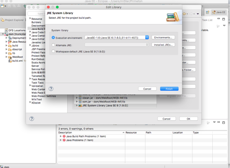
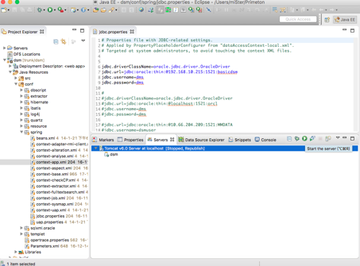
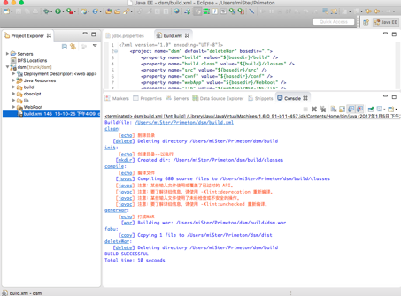

# Primeton DataStandardCube 6 开源说明

**1.产品简介**

Primeton DataStandardCube6LA（[普元](http://www.primeton.com/)数据标准）是一个高性能、易管控的数据标准管理平台，对数据字典、逻辑数据模型、元数据等制定统一标准的数据定义和统一标准的数据模型，清晰定义了每个数据元素的代码、名称、描述、来源等属性，减少数据定义二义性，规范系统建设时对业务的统一理解，增强了业务部门、技术部门对数据的定义与使用的一致性，促进系统集成和信息资源共享，为企业提供统一的信息视图和数据规范，支持管理信息能力的发展。

数据标准平台提供便捷的标准查询、发布以及清晰的标准落地情况，可以清晰的查询数据标准定义公共代码、信息项的概要信息、详细信息，也可以导出WORD存档，及时掌握系统数据定义和使用的标准化情况，暴露各系统数据标准问题，结合业务规则发布数据标准，执行数据标准计划，通过查询数据标准在在系统中的落地情况，真正的掌握数据标准业务数据在业务系统中真正贯彻的情况，做到技术与业务环节真正的打通

* 1.1  数据标准发布查询

[普元](http://www.primeton.com/)数据标准管理平台的数据标准发布查询包括数据标准信息查询，标准代码查询，数据标准电子版查询等功能。

* 1.2  数据标准变更查询

[普元](http://www.primeton.com/)数据标准管理平台的数据标准变更查询包括数据标准变更记录查询等。

* 1.3  数据标准发布

[普元](http://www.primeton.com/)数据标准管理平台的数据标准发布包括动态信息管理，建议/反馈信息管理，数据标准信息项发布，标准代码发布，数据标准电子版发布等。

* 1.4  数据标准执行

[普元](http://www.primeton.com/)数据标准管理平台的数据标准执行包括代码映射管理等。

* 1.5  数据标准变更

[普元](http://www.primeton.com/)数据标准管理平台的数据标准变更包括数据标准变更需求提交，数据标准变更需求审批等。

* 1.6  数据标准需求

[普元](http://www.primeton.com/)数据标准管理平台的数据标准需求包括数据标准需求提交，数据标准需求审核等。

2.**产品关键特性**

* 2.1 体系浏览

根据第三方数据模型服务接口，可以获取不同业务主题的数据模型设计作为参考依据与设计借鉴。

* 2.2 数据标准需求与变更

可以根据业务需求定制新的数据设计标准，同时发布标准，如果标准有变更还可以修改，同时记录下变更历史信息。

* 2.3 数据标准发布

按照业务需求相通性以及行业标准初始化和维护一些数据标准模型字典，供代码设计作参考，也可以发布电子文档版本供下载参考使用。

* 2.4 代码映射

对相关设计代码可以从数据标准发布中，选择公共的设计代码做映射管理。

* 2.5 成熟产品与大量案例支撑

在多个大型企业的核心项目中使用，产品成熟度高。

## 总体架构设计说明

数据标准管理系统实现标准申请、制定、审核、发布、维护的闭环管理，推动标准在业务领域和技术领域的落地实施，提高整体业务运行和管理效率.

***

一. 数据标准管理产品功能架构

 

二. 推动数据标准落地执行

三. 辅助系统数据模型设计

四. 构建可持续发展数据标准管理体系

## 版本说明

**1.版本说明**

  * 版本号：Primeton DataStandardCube 6

说明： 普元数据标准管理平台主要由数据标准发布查询、数据标准变更查询、数据标准发布、数据标准执行、数据标准变更、数据标准需求六块组成，提供了数据标准治理、代码映射管理和主题体系浏览管理等功能。

 * 环境要求：
  * 操作系统：Windows 2003/XP/7/8/10、Linux
  * J2EE服务器：WebSphere 8.5、Tomcat 6.0、WebLogic 10.3.6、WebLogic 12.1.3
  * JDK：SUN JDK1.6
  * 数据库：Oracle 10g 
  * 浏览器：IE 8 / 9 / 10 / 11、FireFox 49、Chrome 49 

# 快速部署开发
* 一. ***安装第一步***，建立数据库账户
请在oracle10g中自己创建用户名和密码，本系统默认默认使用dms/dms为用户名和密码。
* 二. ***安装第二步***，按顺序执行数据库初始化脚本
下图为源代码根目录下面的dbscript文件夹中的脚本文件。

说明：

* 1 执行脚本00.ini.sql创建数据库及用户
* 2 执行脚本02_table.sql  创建数据标准平台系统相关表
* 3 执行脚本03_qrtz.sql 创建数据标准平台任务调度相关表
* 4 执行脚本04_TaskJob.sql创建数据标准平台自动通知任务相关表
* 5 执行脚本05_initData.sql 初始化数据标准平台菜单及数据相关表
* 6 执行脚本06_alterTable.sql 初始化超级管理员及系统相关数据

* 三. ***安装第三步***，导入源码工程

1.首先需要从github服务器上面把工程源代码签到本地，或者直接下载dsm.src.zip。

2.然后解压源文件dsm.src.zip,解压后的当前目录会生成dsm文件夹。

3.使用开发工具eclise,选中刚才解压的目录的根目录作为项目空间，或者你直接使用自己的项目默认空间，打开eclipse。

4.导入dsm源代码到eclipse.

* 四. ***安装第四步***，修改eclipse jdk到1.6.XX。

1.修改开发工具eclipse的编译环境jdk为1.6.XX。

2.修改后，完后的截图效果如下。

* 五. ***安装第五步***，部署到tomcat6.0.XX

1.本机修改源代码中的数据库链接如下图。

2.编译工程，然后发布到tomcat.

3.看到如下启动界面显示，代表系统运行成功。

4.接着输入http://localhhost:8080/dsm,会看到登陆页面，然后属于默认用户admin/123456.查看效果。

* 六. ***安装第六步***，验证打包脚本build.xml

1.在dsm项目根目录下，对着build.xml右键选中，下图按钮。

2.看到下图显示，表现打包脚本顺利完成。

# 关于[普元](http://www.primeton.com/)

[普元](http://www.primeton.com/)软件（Primeton）是全球领先的SOA中间件厂商，并且是SOA国际标准SCA/SDO的主要参与制定者和电子商务标准的主要制定者OASIS的核心奠基成员。

[普元](http://www.primeton.com/)以帮助企业建立统一的数据标准管理和度量管理体系为目标，创造了领先的数据标准管理系统－Primeton DataStandardCube。 该产品集数据标准发布查询、数据标准变更查询、数据标准发布、数据标准执行、数据标准变更、数据标准需求报告组件为一体。对数据字典、逻辑数据模型、元数据等制定统一标准的数据定义和统一标准的数据模型，清晰定义了每个数据元素的代码、名称、描述、来源等属性，减少数据定义二义性。真正的掌握数据标准业务数据在业务系统中真正贯彻的情况，做到技术与业务环节真正的打通。 

**公司网址**：[__http://www.primeton.com__](http://www.primeton.com)

[**cservice@primeton.com**](mailto:cservice@primeton.com)

__总机__：**86-21-50805188**

